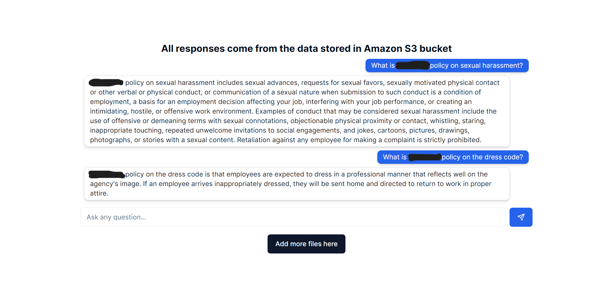
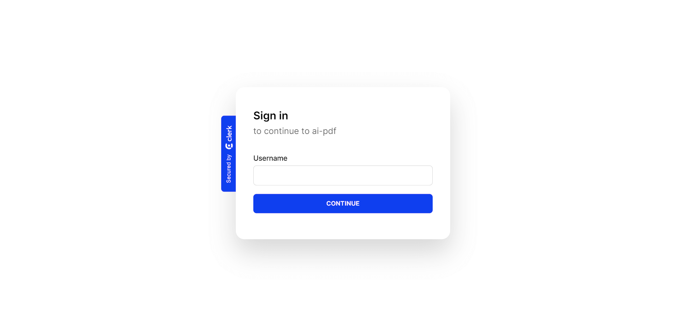

# AI-PDF

## Table of Contents

- [License](#license)
- [Project Overview](#project-overview)
- [Purpose and Inspiration](#purpose-and-inspiration)
- [Issues](#issues)
- [Technologies Used](#technologies-used)
- [Process Overview](#process-overview)

## License

This project is licensed under the MIT license.

## Project Overview

AI-PDF is an AI document scanner. Users can load PDFs to Amazon S3, then ask the AI questions about the uploaded files. The AI can even pinpoint the page where it found the information. For confidentiality, login authentication using Clerk is implemented.

## Purpose and Inspiration

My client needed an efficient way to parse numerous PDFs for specific information like company protocols and regulations. This solution simplifies their task significantly.

## Issues

### Large Size PDFs

The large file sizes of PDFs prevented their upload through the standard homepage 'file upload' feature. To resolve this, I set up an Amazon S3 account shared with my client, allowing them to upload directly to the database and avoid the 15-second timeout issue.

### Extracting Text for AI Parsing

Text extraction from PDFs for AI parsing was a key challenge addressed in the development process.

## Process Overview

### 1. Retrieve the Text from a PDF

- **Tool Used**: `pdf-parse` npm package for extracting text.
- **Functionality**: Function to split text and remove unnecessary characters, like new lines.

### 2. Vectorize and Embed the Individual Documents

- **Text to Embedding**: Used `openai.createEmbedding` for converting text to embeddings.
- **Upload to Pinecone DB**: Uploaded vectors to Pinecone DB for future retrieval.

### 3. Retrieving the Appropriate Vectors

- **Vector Search**: Performed searches in Pinecone to match user queries.

### 4. Prepare the Vector Results for OpenAI

- **Formatting with Langchain**: Used Langchain to format vectors for OpenAI comprehension.

### 5. Use OpenAI to Generate the Response

- **AI Response Generation**: Utilized OpenAI to generate responses from prepared content.

## Technologies Used

### Front End:

- React.js
- Next.js
- TypeScript
- TailwindCSS
- Clerk Auth
- Langchain
- Openai-edge

### Back End:

- Amazon S3
- NeonDB
- PineconeDB
- PostgreSQL
- Drizzle ORM

> Due to the sensitive nature of this project, specific data details cannot be shared. For more information or a detailed walkthrough, please reach out directly.

